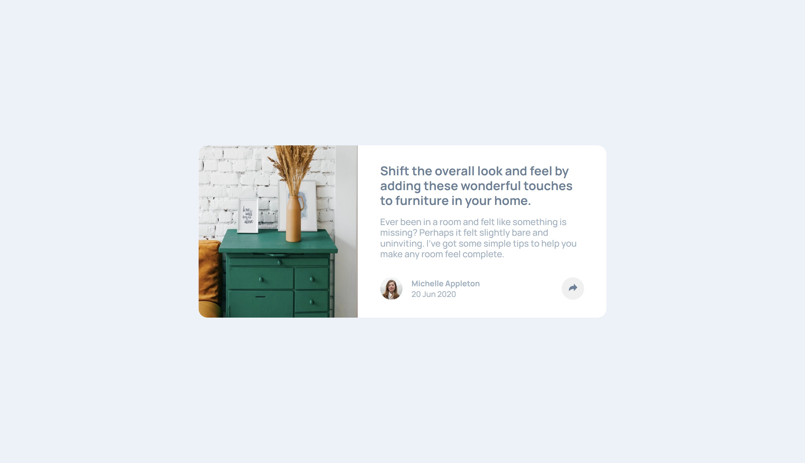

# Frontend Mentor - Article preview component solution

This is a solution to the [Article preview component challenge on Frontend Mentor](https://www.frontendmentor.io/challenges/article-preview-component-dYBN_pYFT). Frontend Mentor challenges help you improve your coding skills by building realistic projects.

## Table of contents

- [Overview](#overview)
  - [The challenge](#the-challenge)
  - [Screenshot](#screenshot)
  - [Links](#links)
- [My process](#my-process)
  - [Built with](#built-with)
  - [What I learned](#what-i-learned)
  - [Continued development](#continued-development)
  - [Useful resources](#useful-resources)
- [Author](#author)

## Overview

### The challenge

Users should be able to:

- View the optimal layout for the component depending on their device's screen size
- See the social media share links when they click the share icon

### Screenshot



### Links

- Solution URL: [Add solution URL here](https://your-solution-url.com)
- Live Site URL: [Add live site URL here](https://your-live-site-url.com)

## My process

### Built with

- Semantic HTML5 markup
- CSS custom properties
- Flexbox
- Mobile-first workflow

### What I learned

Made proper use of semantic element tags.
Better understood how to implement "wrapper".
Sort of understand how to use position and how to counter margins with negative numbers. Not sure why, but whatever works.
Made good use off toggle classList in javascript.
Overall kept my code nice, clean, making it easy to understand!

Proud of this little bit, and the pairing css the "active" class altered.

```js
function shareHandle() {
  console.log("share clicked");
  footerSection.classList.toggle("active");
}
```

### Continued development

Top 3 things I would like to better understand is css-positioning, html-semantic markup and better bem, and javascript as a whole.
Oh, and more libraries/ frameworks. The better I understand existing tools the better of a developer I can become 😊.

### Useful resources

- [HTML- Semantic Tags](https://www.w3schools.com/html/html5_semantic_elements.asp) - This helped by providing a visual of the available semantic tags, and info about them.
- [Css- Share Bubble Tail](https://www.geeksforgeeks.org/how-to-create-triangle-in-css/) - This helped me make the triangle/tail part of share bubble.
- [JS- ClassList](https://www.w3schools.com/howto/howto_js_toggle_class.asp) - This helped me with the class list toggle.

## Author

- Frontend Mentor - [@moncadad](https://www.frontendmentor.io/profile/moncadad)
